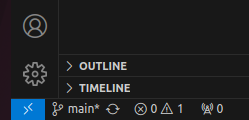
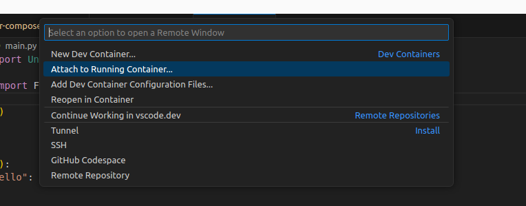
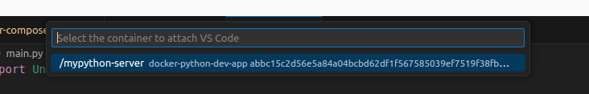
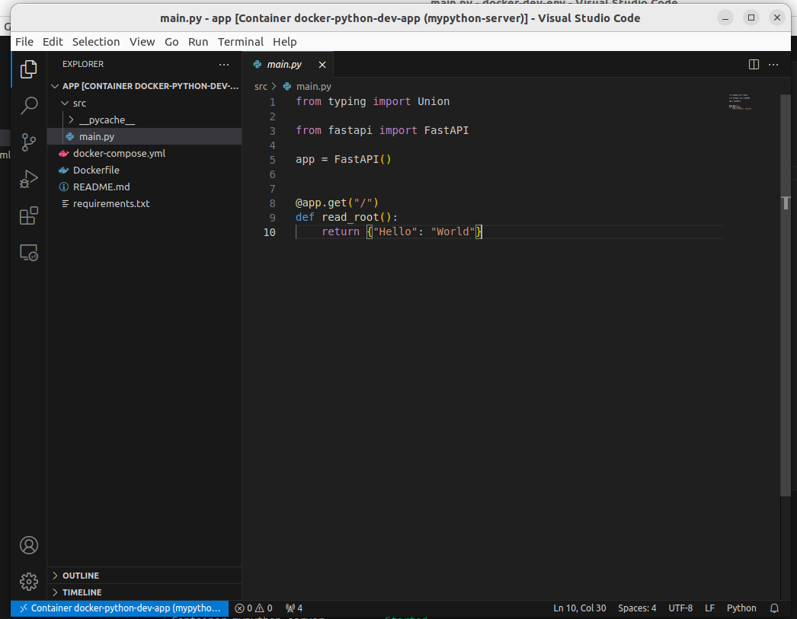
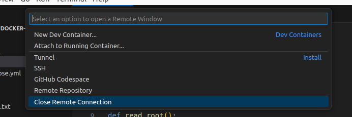

# Setup a Python development environment with Docker

No need to install Python and libraries in your local environment. Use the Python docker image as your development environment. <br/>
With Visual Studio Code Dev Containers extension. VS Code can use the docker container as development environment, the codes can be referenced directly in the container by docker volumn (-v $(pwd):/app, codes in current fold will be refered to /app folder). <br/>
Use Dev Containers remote window function, a VS Code session is connected to docker container environment which includes the Python version and libraries defined in Dockfile and requirements.txt

## Build Docker image

### build docker image

```
docker build -t mypython-dev-image .
```

### run docker

```
docker run -d --name mypython-dev-container -p 80:80 -v $(pwd):/app mypython-dev-image
```

### docker compose

```
docker compose up -d
```

## Setup Visual Studo Code

### Extensions:

1. Docker
2. Dev Containers
3. Python (optional)

## Connect Visual Studio to container

Click the left bottom button to open remote window function list


Attach to a running container


Select the docker container


Visual Studio Code editor in remote mode


Close remote connection with finish



## Reference List

1. [How to Create a Great Local Python Development Environment with Docker](https://youtu.be/6OxqiEeCvMI?si=0JaA0c2dHo4MynXi)